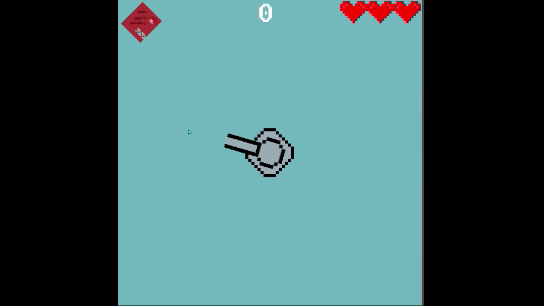
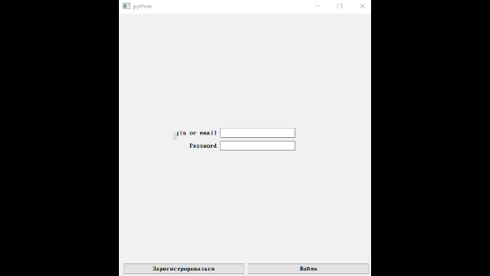

## Это проект для...
Это проект для Яндекс Лицея, а это значит что он был сделан в определённые сроки с определёнными условиями.
То есть тут есть недочёты или недоделки, или проект сделан коряво. ~~Вася удали этот абзац, если ты этот проект считаешь полностью готовым и он не порочит твою честь.~~ 

## Немного о файлах и каталогах
- For_lyceum - папка с отчётом, презентацией и несколько файлов с показом программы
- images - папка с изображениями для спрайтов
- ui - папка с файлами .ui(интерфейсы Qt)
- main.py - запускает скрипт 
- gui_classes.py - файл ответственный за интерфейс Qt
- game_classes.py - файл ответственный за саму игру
- scores.txt - файл где хранятся последние набранные очки
- server_url - файл с url сервера

## Что это?
Это игра, хотя это и так понятно по названию репозитория. Но что именно это за игра. Это игра можно сказать подобие старых аркад, где ты отстреливаешь бесконечные волны врагов. В игре присутствует таблица лидеров, где можно увидеть результаты игроков со всего мира.
Ладно, хватит болтовни, надо показать геймплей.

## Также...
Также в проекте присутствует регистрация и авторизация с сервером, на котором лежат базы данных пользователей, кстати за ваши данные я ответственности **не** несу.
**Ну и без авторизации вы не можете играть.**

## Состояние сервера
Тут будет написано состояние сервера, сейчас он в норме и работает.
